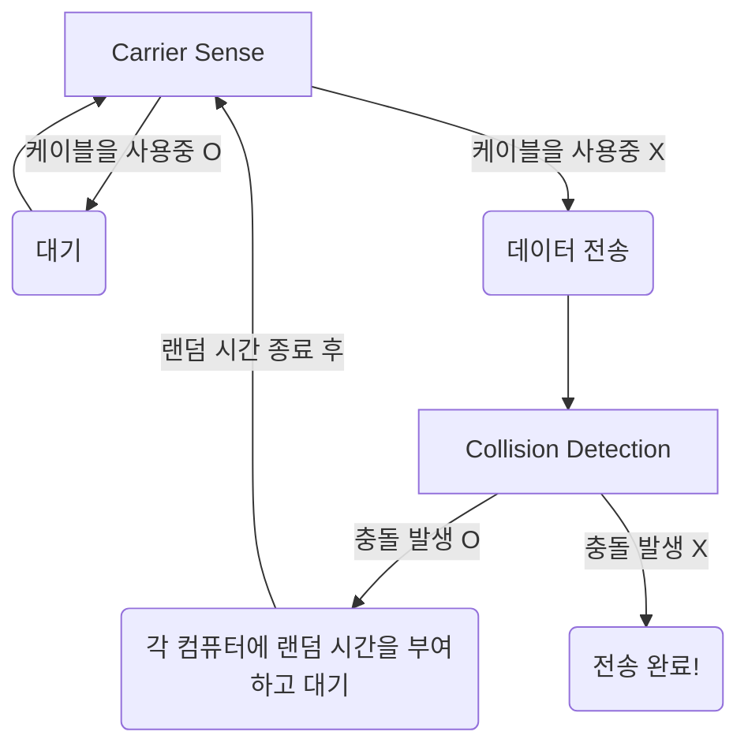

 
 
 
 

# 데이터 링크 계층

- 하나의 네트워크 대역 내에서 데이터를 전달하는 역할을 하는 계층이다.
  - 하나의 네트워크 즉, 같은 LAN 내의 노드끼리의 통신
  - 다른 네트워크와 통신할 때는 3계층의 도움이 필요하다.
- 물리적 주소 설정, 오류 제어와 흐름 제어를 수행한다.
- 주요 프로토콜로는 이더넷 프로토콜이 있다.
- 주요 기기로는 스위치(스위칭 허브)가 있다.
  - l1의 더미 허브와 모양이 같다.
- 2계층의 PDU는 프레임이다.
- 부계층으로는
  - LLC (Logical Link Control)
  - MAC (Media Access Control)
    - 물리적인 매체 연결 방식을 제어한다.
    - 물리 계층과 연결하는 역할.

 
 

## MAC address

- 컴퓨터의 물리적인 주소를 뜻한다.
- 기기가 갖고 있는 물리적 주소이며, 반영구적이다.
- '제조 회사의 고유번호 : 기기의 고유번호'의 모양을 갖고 있다.
- 6byte = 48bit의 길이를 가진다.

 
 

## 이더넷 프레임

- l2의 PDU이다.
- 데이터의 앞에 붙는 이더넷 헤더와
  - 목적지 MAC 6byte + 출발지 MAC 6byte + 타입 2byte = 14byte
  - 타입은 캡슐화된 상위 3계층의 프로토콜을 알려주기 위함
    - 그래야 역캡슐화 할 때 해석할 수 있음
    - IPv4, IPv6, ARP ...
- 데이터의 뒤에 붙는 트레일러가 있다.
  - 4byte
  - FCS
    - Frame Check Sequence
    - 오류 발생 체크 용도

 

_이더넷 프레임_

 

- Destination Address
  - 목적지 맥 주소
- Source Address
  - 출발지 맥 주소
- Type
  - 데이터에 담겨 있는 상위 프로토콜의 타입을 나타내는 값

 
 
 
 

# 이더넷 프로토콜

- 데이터 전송 프로토콜이다.
- 유선 네트워크 구성에 사용된다.
  - 일반적으로 LAN에서 많이 사용됨.
  - 기존에는 버스형을 많이 사용했지만, 최근에는 성형으로 바뀌는 추세이다.
- CSMA/CD 기술을 사용한다.

 

_이더넷 프로토콜_

 
 

### CSMA/CD

- Carrier Sense Multiple Access/Collision Detection
- 버스형으로 구성된 네트워크에서는 여러 대의 기기가 데이터 전송을 하면, 충돌이 발생한다.
- 이런 상황을 고려해 나온 매커니즘이 CSMA/CD이다.

 

_버스형 토폴로지_

 

- Carrier Sense
  - 전송 전에 케이블이 사용중인지 감지한다.
    - 사용중이 아니라면 전송한다.
    - 사용중이라면 대기한다.
- Collision Detection
  - 전송했다가 충돌이 발생한다.
    - 충돌을 감지하고 랜덤 시간만큼 대기한다.
      - 이때 충돌이 발생했던 두 노드의 대기 시간은 각각 다르게 설정해준다.
    - 대기가 끝나면 다시 전송한다.

 

> 초기 이더넷은 반이중 통신을 했다
> - 송신/수신 둘 중 하나만 가능
> - 동시에 송신을 하면 충돌 발생

> 그러나 현재의 이더넷은 전이중 통신을 한다
> - 송신/수신 동시에 가능
> - 동시 송신도 원활하게 가능

> 초기에는 버스형으로 네트워크를 구성했지만,
> 최근에는 성형으로 바뀌는 추세이다.

 
 

# 스위치

- 스위칭 허브라고도 한다. 생긴게 더미 허브랑 똑같다.
- 이더넷을 통해 하나의 네트워크를 구성하는 기기이다.
- MAC 주소 테이블을 갖고 있다.
  - 어떤 노드가 어떤 포트로 가야 있는지 기록해두는 캐시 테이블이다.
- 세 가지 동작을 수행한다.
  - flooding
    - 요청을 보낸 포트 외에 나머지 모든 포트에 요청을 전송
  - filtering
    - MAC 주소 테이블을 이용해서, 수신지 MAC 주소가 있는 포트 외의 다른 포트에는 전송하지 않음
  - forwarding
    - MAC 주소 테이블을 이용해서, 수신지 MAC 주소와 일치하는 포트로 전

 

_MAC Table_

 

1. aa 노드가 port1을 타고 bb 주소로 요청을 보내왔다.
   - aa 노드에 대한 포트 정보를 알게된 스위치가 MAC 테이블에 주소와 포트 정보를 기록해둔다.
   - 스위치의 MAC 테이블은 bb 노드의 포트를 알지 못한다.
2. 연결된 모든 포트들로 요청을 보낸다.
   - 자신에게 온 요청이 아닌 경우 노드들은 요청을 무시한다.
3. 자신에게 온 요청인 것을 확인한 bb 노드가 응답을 보낸다.
   - 스위치가 bb 노드와 포트 정보를 알게 됐으므로, MAC 테이블에 bb 노드의 정보를 기록해둔다.
4. 스위치가 aa 노드로 bb 노드의 응답을 전송한다.
   - 요청을 보낼 때 기록해둔 테이블의 정보를 참조해서,
   - 다른 노드가 아닌 aa 노드에게만 응답을 전송한다.

 
 
 
 

