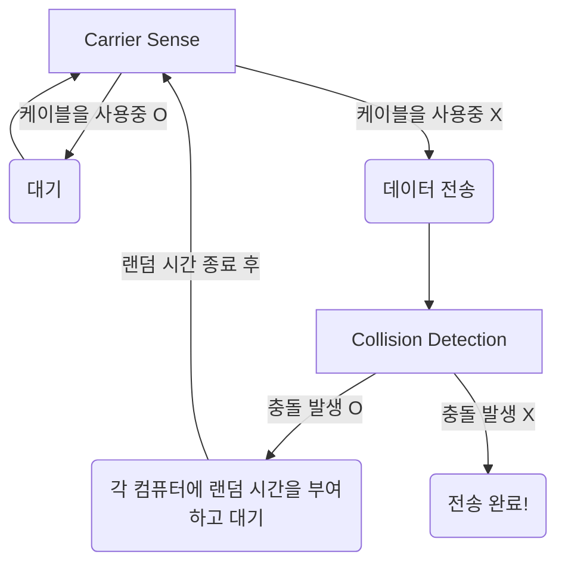

 
 
 
 

# 데이터 링크 계층

- 하나의 네트워크 대역 내에서 데이터를 전달하는 역할을 하는 계층이다.
  - 하나의 네트워크 즉, 같은 LAN 내의 노드끼리의 통신
  - 다른 네트워크와 통신할 때는 3계층의 도움이 필요하다.
- 물리적 주소 설정, 오류 제어와 흐름 제어를 수행한다.
- 주요 프로토콜로는 이더넷 프로토콜이 있다.
- 주요 기기로는 스위치(스위칭 허브)가 있다.
  - l1의 더미 허브와 모양이 같다.
- 2계층의 PDU는 프레임이다.
- 부계층으로는
  - LLC (Logical Link Control)
  - MAC (Media Access Control)
    - 물리적인 매체 연결 방식을 제어한다.
    - 물리 계층과 연결하는 역할.

 
 

## MAC address

- 컴퓨터의 물리적인 주소를 뜻한다.
- 기기가 갖고 있는 물리적 주소이며, 반영구적이다.
- '제조 회사의 고유번호 : 기기의 고유번호'의 모양을 갖고 있다.
- 6byte = 48bit의 길이를 가진다.

 
 

## 이더넷 프레임

- l2의 PDU이다.
- 데이터의 앞에 붙는 이더넷 헤더와
  - 목적지 MAC 6byte + 출발지 MAC 6byte + 타입 2byte = 14byte
  - 타입은 캡슐화된 상위 3계층의 프로토콜을 알려주기 위함
    - 그래야 역캡슐화 할 때 해석할 수 있음
    - IPv4, IPv6, ARP ...
- 데이터의 뒤에 붙는 트레일러가 있다.
  - 4byte
  - FCS
    - Frame Check Sequence
    - 오류 발생 체크 용도

_이더넷 프레임_

 
 
 
 

# 이더넷 프로토콜

- 데이터 전송 프로토콜이다.
- 유선 네트워크 구성에 사용된다.
  - 일반적으로 LAN에서 많이 사용됨.
  - 기존에는 버스형을 많이 사용했지만, 최근에는 성형으로 바뀌는 추세이다.
- CSMA/CD 기술을 사용한다.

 

_이더넷 프로토콜_

 
 

### CSMA/CD

- Carrier Sense Multiple Access/Collision Detection
- 버스형으로 구성된 네트워크에서는 여러 대의 기기가 데이터 전송을 하면, 충돌이 발생한다.
- 이런 상황을 고려해 나온 매커니즘이 CSMA/CD이다.

 

_버스형 토폴로지_

 

- Carrier Sense
  - 전송 전에 케이블이 사용중인지 감지한다.
    - 사용중이 아니라면 전송한다.
    - 사용중이라면 대기한다.
- Collision Detection
  - 전송했다가 충돌이 발생한다.
    - 충돌을 감지하고 랜덤 시간만큼 대기한다.
      - 이때 충돌이 발생했던 두 노드의 대기 시간은 각각 다르게 설정해준다.
    - 대기가 끝나면 다시 전송한다.

 

> 초기 이더넷은 반이중 통신을 했다
> - 송신/수신 둘 중 하나만 가능
> - 동시에 송신을 하면 충돌 발생

> 그러나 현재의 이더넷은 전이중 통신을 한다
> - 송신/수신 동시에 가능
> - 동시 송신도 원활하게 가능

> 초기에는 버스형으로 네트워크를 구성했지만,
> 최근에는 성형으로 바뀌는 추세이다.

 
 
 
 
